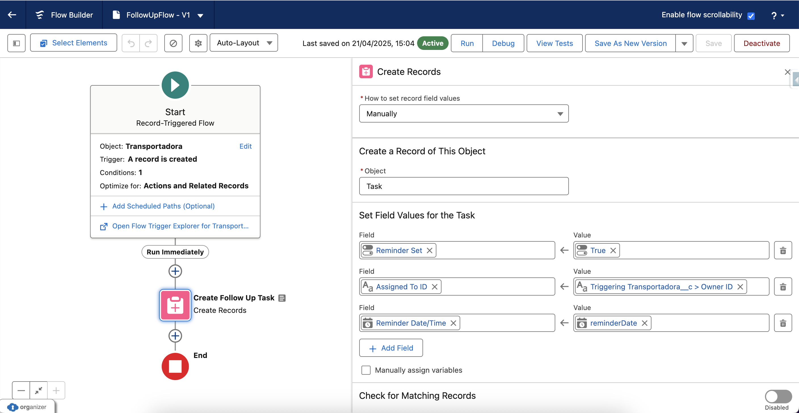

# Tech Challenge Documentation

## Overview
This project implements a Salesforce solution for managing `Transportadora__c` records. It includes a RESTful Apex controller, a trigger for handling status changes, utility classes for email notifications and logging, and a Flow for task creation. The solution supports CRUD operations, ensures proper logging, email notifications for specific events, and automates task creation.

---

## Components

### 1. **TranspController**
The `TranspController` class is a RESTful Apex controller that provides CRUD operations for the `Transportadora__c` custom object.

#### **Features**
- **GET**: Retrieve a `Transportadora__c` record by its CNPJ.
- **POST**: Upsert (insert or update) multiple `Transportadora__c` records.
- **DELETE**: Delete a `Transportadora__c` record by its CNPJ.

#### **URL Mapping**
- Base URL: `/services/apexrest/transportadoras/*`

#### **Methods**
- **`@HttpGet getTranspByCnpj()`**  
  Retrieves a `Transportadora__c` record by its CNPJ.  
  - **Success Response**: Returns the record's CNPJ if found.
  - **Error Response**: Returns an error if the record is not found.

- **`@HttpPost upsertTransp()`**  
  Upserts multiple `Transportadora__c` records.  
  - **Success Response**: Inserts new records or updates existing ones.
  - **Error Response**: Returns an error if the request body is invalid.

- **`@HttpDelete deleteTransp()`**  
  Deletes a `Transportadora__c` record by its CNPJ.  
  - **Success Response**: Confirms the record was deleted.
  - **Error Response**: Returns an error if the record is not found or cannot be deleted.

#### **Helper Classes**
- `TranspList`: Represents a list of `TransportadoraWrapper` objects.
- `TransportadoraWrapper`: Represents the structure of a `Transportadora__c` record in the request body.
- `JsonResponse`: Represents the structure of the JSON response.

---

### 2. **HandleTranspTrigger**
The `HandleTranspTrigger` is an Apex trigger that runs after insert and update operations on `Transportadora__c` records.

#### **Trigger Logic**
- If a `Transportadora__c` record's status is updated to "Inativa" and it has a valid email:
  - Sends an email notification using the `EmailManager` class.
  - Logs the email event in the `Log__c` object.

#### **Trigger Events**
- **After Insert**: Sends an email if the new record's status is "Inativa".
- **After Update**: Sends an email if the status changes to "Inativa".

---

### 3. **EmailManager**
The `EmailManager` class handles email notifications and logs the results in the `Log__c` object.

#### **Method**
- **`sendMail(String email, String subject, String body, String id)`**  
  Sends an email and logs the result.  
  - **Parameters**:
    - `email`: Recipient's email address.
    - `subject`: Email subject.
    - `body`: Email body.
    - `id`: Associated record ID.
  - **Returns**: `true` if the email was sent successfully, `false` otherwise.

---

### 4. **Task Creation Flow**
A Salesforce AutolaunchedFlow is configured to automatically create tasks whenever a `Transportadora__c` record is created and has "Ativa" as Status__c.

#### **Flow Logic**
- When a new `Transportadora__c` record is created:
  - A new task is created and assigned to the owner of the `Transportadora__c` record.
  - A scheduled task is created with a due date 15 days from the creation date.

#### **Task Details**
- **Scheduled Task**:
  - **Assigned To**: Owner of the `Transportadora__c` record.
  - **Due Date**: 15 days from the creation date.

---

## Testing

### 1. **TranspControllerTest**
Unit tests for the `TranspController` class.

#### **Test Methods**
- `parseFailTest`: Tests invalid JSON parsing.
- `noExtIdFailTest`: Tests missing external ID (CNPJ).
- `getTransSuccessTest`: Tests successful retrieval of a record.
- `getTransFailTest`: Tests retrieval of a non-existent record.
- `upsertTransSuccessTest`: Tests successful upsert of records.
- `deleteTransSuccessTest`: Tests successful deletion of a record.
- `deleteTransFailTest`: Tests deletion of a non-existent record.

---

### 2. **HandleTranspTriggerTest**
Unit tests for the `HandleTranspTrigger`.

#### **Test Methods**
- `AfterUpdateSuccessTest`: Tests successful email notification and logging after an update.
- `AfterUpdateFailTest`: Tests failure to send an email due to missing email address.
- `AfterInsertSuccessTest`: Tests successful email notification and logging after an insert.
- `AfterInsertFailTest`: Tests failure to send an email due to missing email address.

---

## Labels Used
The following custom labels are used for messages:
- `success`: Indicates a successful operation.
- `error`: Indicates an error occurred.
- `transp_not_found`: Message for a missing `Transportadora__c` record.
- `transp_found`: Message for a found `Transportadora__c` record.
- `transp_deleted`: Message for a successfully deleted record.
- `upsert_success`: Message for a successful upsert operation.
- `delete_error`: Message for a failed delete operation.

---

## Logging
All email notifications are logged in the `Log__c` object with the following fields:
- `Associated_Id__c`: The ID of the associated `Transportadora__c` record.
- `Status__c`: Indicates success or failure of the email.
- `Message__c`: Contains details about the email operation.

---

## Deployment
Ensure the following components are deployed:
- Apex Classes: `TranspController`, `EmailManager`
- Apex Trigger: `HandleTranspTrigger`
- Test Classes: `TranspControllerTest`, `HandleTranspTriggerTest`
- Custom Object: `Log__c`, `Transportadora__c`
- Flow: Task Creation Flow
- Custom Labels: As listed above